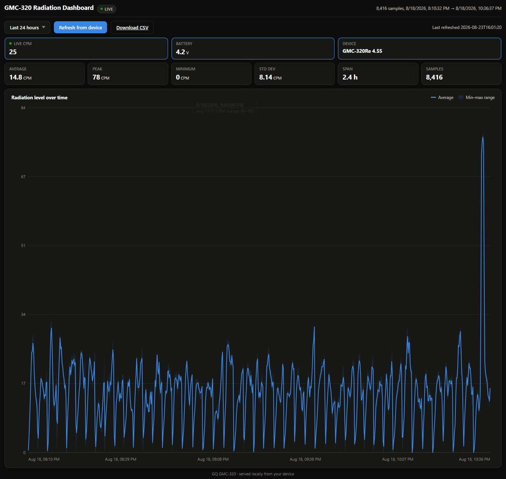

# GMC-320 Radiation Dashboard

A serial client and web dashboard for the GQ GMC-320 Geiger counter. Pulls
history off the device over USB, parses the raw flash format, and serves a
live + historical dashboard in a browser. No external services, no cloud
dependency — everything runs locally, including on a Raspberry Pi.



## Features

- Live CPM and battery voltage, polled directly from the device
- Full history download and decode (the device's raw flash format, including
  its `0x55 0xAA` marker records for timestamps and mode changes)
- Time-range dashboard (hour / day / week / month / all-time) backed by a
  proper server-side resample, not a client-side downsample of a downsample
- One-click history refresh from the browser, with progress reporting
- CSV and SQLite export
- Self-contained HTML/JS frontend — no build step, no npm, no CDN dependency
- Auto-detects the device's serial port by USB VID:PID

## Requirements

- Python 3.9+
- A GQ GMC-320 (or compatible GQ GMC unit) connected over USB
- [`pyserial`](https://pypi.org/project/pyserial/) — the only dependency

Tested against a GMC-320Re running firmware 4.55. Baud rate, max SPI-read
chunk size, and history layout are auto/config-driven where the protocol
allows it, but see **Known quirks** below if you're on different firmware.

## Installation

```bash
git clone https://github.com/<your-username>/gmc320-dashboard.git
cd gmc320-dashboard
pip install -r requirements.txt
```

Plug the GMC-320 in over USB. The serial port is auto-detected by its
USB-serial chip's VID:PID (CH340, CP2102, and PL2303 are all recognized —
the common chips these counters ship with). If auto-detect can't pick a
single candidate, pass `--port` explicitly (`COM6` on Windows,
`/dev/ttyUSB0` on Linux/Raspberry Pi).

## Usage

**Live web server** (recommended):

```bash
python server.py
# or explicitly:
python server.py --port /dev/ttyUSB0 --http-port 8080
```

Browse to `http://localhost:8080/`, or `http://<host-ip>:8080/` from another
device on the network. First load will be empty until you click "Refresh
from device" to pull history.

**One-off download + static file**, no server required:

```bash
python download_history.py
python build_dashboard.py
# open data/dashboard.html directly in a browser
```

A full history download takes a while — the device's flash is read in
2048-byte chunks over a 19200 baud serial link, so a full 1MB takes roughly
25 minutes. There's no "read only new data" command in the protocol, so a
refresh re-reads the entire flash every time. The live CPM/voltage panel
keeps working during a refresh; it just skips poll cycles while the download
holds the serial port.

## Running on boot (Raspberry Pi)

```ini
# /etc/systemd/system/gmc-dashboard.service
[Unit]
Description=GMC-320 radiation dashboard
After=network.target

[Service]
ExecStart=/usr/bin/python3 /home/pi/gmc320-dashboard/server.py
WorkingDirectory=/home/pi/gmc320-dashboard
Restart=on-failure
User=pi

[Install]
WantedBy=multi-user.target
```

```bash
sudo systemctl enable --now gmc-dashboard
```

If other USB-serial devices are attached to the same Pi, pin the exact
device instead of relying on auto-detect or the unstable `/dev/ttyUSB0`
numbering:

```bash
ls /dev/serial/by-id/
# then in the service file:
ExecStart=/usr/bin/python3 server.py --port /dev/serial/by-id/<id>
```

## Project structure

| File | Purpose |
|---|---|
| `gqgmc.py` | Serial protocol client — version, CPM, voltage, history reads, port auto-detection |
| `history_parser.py` | Decodes the raw flash dump into timestamped CPM/CPS samples |
| `download_history.py` | CLI + importable `run_download()` for pulling history into CSV/SQLite |
| `dashboard.py` | Dashboard HTML/JS rendering (chart, stat tiles, live panel, range queries) |
| `build_dashboard.py` | CLI for a static `data/dashboard.html`, no server needed |
| `server.py` | stdlib-only web server: live polling, refresh endpoint, dashboard serving |
| `reparse.py` | Re-parse an existing raw flash dump without hitting the device again |

`data/` (git-ignored) holds the downloaded artifacts: `history_raw.bin`,
`history.csv`, `history.sqlite`.

## Known quirks

Protocol behavior found by testing against real hardware, not always
matching the published GQ-RFC1201 spec:

- **Baud rate is model/firmware-dependent.** 57600 is the commonly-cited
  default; this unit only responds at 19200.
- **Max SPI read chunk size is firmware-dependent too.** The spec caps
  `<SPIR...>>` reads at 4096 bytes; this firmware silently fails above 2048.
- **`0xFF` is flash filler, not data.** Unwritten flash reads back as `0xFF`.
  Treating it as a literal CPS value of 255 produces bogus 15,000+ CPM
  spikes wherever a read happens to catch unwritten space — strip it before
  computing statistics.
- **The device's flash is close to linear, not a hard circular buffer** on
  this unit, but `history_parser.py` still applies GeigerLog's
  marker-alignment approach defensively in case a given unit has wrapped.
- **The onboard RTC drifts.** Observed ~5 days off actual time on the test
  unit. Worth checking `<GETDATETIME>>` periodically if long-gap timestamp
  accuracy matters for your analysis.

## License

MIT — see [LICENSE](LICENSE).
